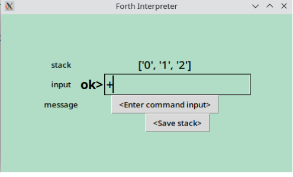

### Forth Interpreter
### From: Coding Challenge #95

This challenge is to build your own Forth-like interpreter able at writing a program to generate at least:
- Fibonacci sequence
- FizzBuzz

Architecture:
- This is a web application, language of programming is Python 
- Gui is rendered with Tkinter library
- The data management is simple, system persists data into JSON files to write/read state of Forth session to the interpreter

General Instructions:  
When generating code, please follow the existing coding style.
Ensure all new functions and classes have appropriate comments.
Prefer functional programming paradigms where appropriate.

Coding Style:
Use 4 spaces for indentation.
Standard coding sytle for Python
Regarding Dependencies:
Avoid introducing new external dependencies unless absolutely necessary.

*Step Zero*:  
This is the first iteration of implementation. 
Prepare interface and how to manage future implementations.
The layout of web app is:
The app has width=600 and height=400, background=light cyan text in black. 
It uses a Tk window with a title, and a canvas with grid 2x3:
*stack*	stack_var
*input*	prompt_text input_var
*message* message_var

```
+------------------------------------------------------+
.                                                      .
.            Forth interrpreter                        .
.                                                      .
.  stack     -------------------------------           .
.                                                      .
.  input     _________ _____________________           .
.                                                      .
.                                                      .
.  message   -------------------------------           .
.                                                      .
.                                                      .
+------------------------------------------------------+ 
```
stack_var and message_var are label with text variables, 
input is divided in prompt_text (label) and prompt_var (entry) 

Logic of step One:
Application shows state of Forth Stack in stack_var from left to right (right is top, data separated by space). In step one no state (blank).
Input prompt shows "ok>" and collects command from user in input_var
At step one, only "bye" is accepted which exists application, other inputs are ignored (system deletes input_var after return) 
In case of errors, prompt will write "err>" and message_text will prompt error message, but not at this stage (blank). 

*Step Two*:
In this step the goal is to handle user entering *integers* and some basic math operations. 
To enable that you need to handle entering an integer. The integer should the be pushed
onto the interpreter's stack. 

The implementation uses a list as stack.

*Step Three*
In this step your goal is to add support for several Forth words used to manipulate the stack: dup, drop, rot, over and swap:
- swap ( n1 n2 -- n2 n1 ) Swaps the top two elements on the stack
- dup ( n -- n n ) Duplicates the top element on the stack
- over ( n1 n2 -- n1 n2 n1 ) Duplicates the second from top element and pushes it on to the top of the stack
- rot ( n1 n2 n3 -- n2 n3 n1 ) Rotates the top three elements on the stack
- drop ( n1 -- ) Pops the top element off the stack.
